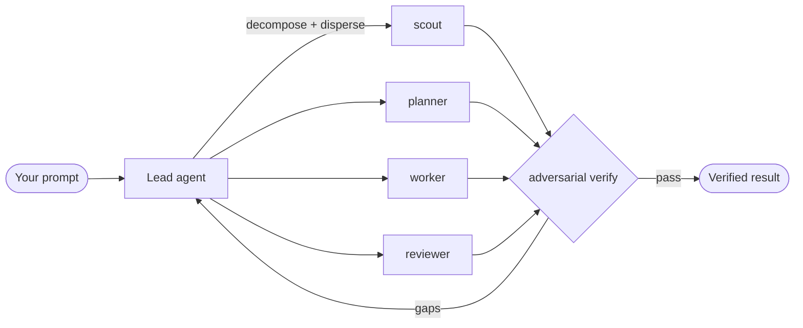
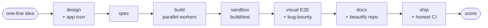
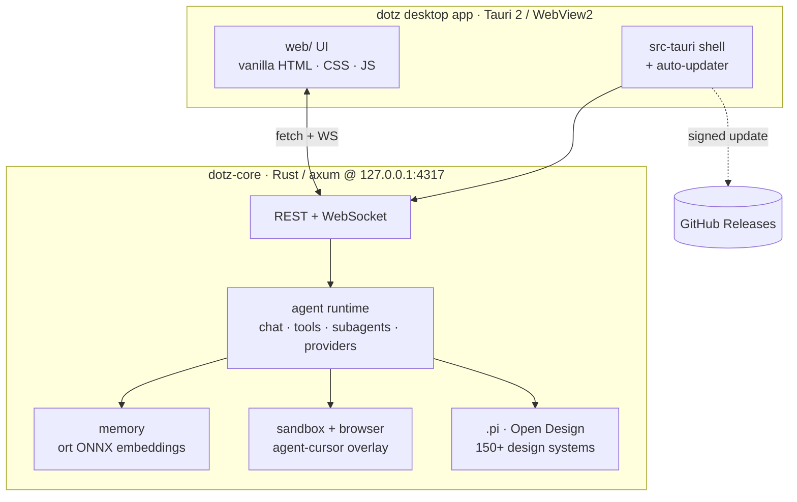

<div align="center">


# dotz

**The in-process multi-agent coding dashboard — one prompt becomes a team of AI coding agents.**

[](https://github.com/cayleb-james2008/dotz/actions/workflows/ci.yml)
[](LICENSE)
[](https://github.com/cayleb-james2008/dotz/releases/latest)
[](https://github.com/cayleb-james2008/dotz/releases/latest)
[](https://github.com/cayleb-james2008/dotz/releases/latest)
[](https://tauri.app)

</div>

dotz is a **native-Rust, multi-agent coding-agent dashboard**. Give it one task and it
decomposes the work, disperses it to a team of subagents, runs them in parallel on a **live workflow
graph**, and adversarially verifies the result before it lands — with live controls for **model,
reasoning effort, tools, skills, and subagent orchestration**, all in a single self-updating desktop app.

Under the hood: `dotz-core` is an [axum](https://github.com/tokio-rs/axum) server with dotz's own
agent runtime (no third-party agent SDK, no IPC serialization — everything runs **in-process**), and a
[Tauri](https://tauri.app) 2 (WebView2) shell wraps it into a signed, self-updating Windows app. It is
**multi-provider** (Ollama Cloud, OpenRouter, Anthropic, OpenAI, Google, Groq, and more), keeps
**persistent projects** + an on-device **memory store** (local ONNX embeddings) injected into the
agent's prompt, ships a **deterministic tool sandbox** with a live web preview the agent drives an
on-screen cursor over, and a native **Open Design** workspace (150+ design systems, live preview,
HTML/PDF export).

<div align="center">

</div>

## Table of Contents

- [Highlights](#highlights)
- [How It Works](#how-it-works)
- [Architecture](#architecture)
- [Safety Patterns](#safety-patterns)
- [Tech Stack](#tech-stack)
- [Controls](#controls-the-five-knobs)
- [Projects, Memory, and Sandbox](#projects-memory-and-sandbox)
- [Design Mode](#design-mode-open-design-native)
- [Setup](#setup)
- [Build and Test](#build-and-test)
- [Development and Gates](#development--gates)
- [Cross-device Auto-update](#cross-device-auto-update)
- [Contributing](#contributing)
- [License](#license)

## Highlights

- **Live workflow graph** — every subagent materializes as a node, every tool it reaches for
  streams onto that node as a live chip; click any node/chip to open the exact panel it drives.
- **Multi-agent by default** — non-trivial tasks fan out to `scout` / `planner` / `worker` /
  `reviewer` subagents in parallel, then the result is adversarially verified before it lands.
- **In-process runtime** — no IPC serialization, no subprocess per agent, no third-party agent SDK.
  The entire agent runtime (chat loop, tools, subagents, providers) lives inside `dotz-core`.
- **Sessions over WebSocket** — the UI is a plain web app (`fetch` + WS streaming), identical in a
  browser against the headless `serve` bin and inside the Tauri window.
- **Deterministic tool sandbox** — `terminal` mode streams stdout/stderr back into chat; `web` mode
  renders an inline preview iframe the agent drives with an on-screen cursor you both can see.
  Bash tools use an **allowlist-only** execution model.
- **On-device memory** — automatic capture/recall/consolidation via `rusqlite` + local ONNX
  embeddings (all-MiniLM-L6-v2, in-process — no embeddings API), mirrored to a committable `MEMORY.md`.
- **Model-agnostic providers** — multi-provider auth with per-provider UI modes (free-form model-id
  input or fixed list) and a reasoning-effort slider constrained to what the model supports.
- **Origin-guarded local API** — the loopback axum server rejects disallowed `Origin`/`Host`
  requests with `403`, closing browser-CSRF and DNS-rebinding against the code-exec endpoints.
- **Skills + native Open Design** — a unified skill pool plus a design workspace with 150+ bundled
  design systems, live preview, and HTML/PDF export.
- **Signed self-updates** — `tauri-plugin-updater` verifies a minisign-signed `latest.json` from
  GitHub Releases and updates in place.

## How It Works



Every non-trivial task fans out to `scout` / `planner` / `worker` / `reviewer` subagents that run in
parallel, then their output is adversarially verified before it lands. Pick a **profile** to change the
strategy (WORKFLOW · SOLO · PLAN · FRONTEND · BACKEND · DESIGN · NEW MODEL, NEW PROJECT).

### The Live Workflow Graph — Watch Every Agent and Every Tool

Dispatching work no longer happens off-screen. Every `subagent` call **materializes a live node** on
the workflow graph, and **every tool that agent reaches for** — memory, browser, sandbox, spec, vcs,
design — streams onto its node in real time as a **panel-colored sub-node chip** (running → done/error).
The graph is the single live visual of what the agents are doing; **click a node or a chip to open the
exact panel** that tool drives. Nothing pops open on its own — you watch it happen and drill in on
demand.

### NEW MODEL, NEW PROJECT — One Prompt Ships a Repo

The **NEW MODEL, NEW PROJECT** profile turns one line into a genuinely-useful app shipped to a fresh
public GitHub repo, driven by a **required capability spine** — each phase is its own agent, so each is
a node on the graph:



The **design** phase picks a bundled Open Design system and produces an app icon; **sandbox** and a
**visual E2E / bug-bounty** phase (the agent launches the built app in its own web-sandbox and clicks
through the real frontend) are the authoritative ship gate; the repo is beautified (README, badges,
screenshot, topics) before it ships. A phase runs unless it's genuinely impossible, in which case it's
logged as `skipped <phase>: <reason>` — never faked.

## Architecture



### Component Overview

| Component | Path | Role |
|-----------|------|------|
| **dotz-core** | `dotz-core/` | The pure library + headless `serve`/`selfeval` bins. Owns the whole agent runtime: provider adapters, sessions, the workflow DAG, sandbox, isolated browser, on-device memory, skills, projects, specs. Exposes it over a lean axum + tower-http REST + WebSocket surface. |
| **dotz-tauri** | `src-tauri/` | A thin Tauri 2 shell (`src/main.rs` + `build.rs`) that boots dotz-core on `127.0.0.1:4317`, loads the bundled vanilla-HTML UI into a WebView2 window, and wires `tauri-plugin-updater` for signed cross-device updates. |
| **web/** | `web/` | The bento-style dashboard UI — vanilla HTML/CSS/JS, no build step, no framework. Runs identically in a browser (against headless `serve`) and inside the Tauri WebView2 window. |
| **.pi/** | `.pi/` | Bundled agent resources: agent profiles, workflow prompts, design systems, design skills. |

### Agent Roles

| Role | Responsibility |
|------|---------------|
| **Lead agent** | Receives the user prompt, decomposes the task, disperses subagents, conducts verification, delivers the result. |
| **Scout** | Research and context-gathering: memory recall, codebase exploration, reading existing patterns. |
| **Planner** | Architecture and task breakdown: maps the work into build units, sequences dependencies. |
| **Worker** | Implementation: writes code, runs tests, fixes bugs — fanned out in parallel per independent unit. |
| **Reviewer** | Adversarial verification: checks the work against the spec, tests, and quality bar before it lands. |

### Workflow DAG

The workflow graph is the **single source of truth** — execution and observability read the same
`WorkflowStep` nodes. Steps transition `pending → ready → running → done|error|skipped`; children
auto-promote to `ready` when all parents are `done`. The UI renders the live DAG as an interactive
SVG node/edge graph.

- `workflows.rs` — the `WorkflowRun` DAG domain (`WorkflowStep`, `ToolCallRef` with inspectable
  `args`+`result`).
- `workflow_executor.rs` — drives steps to completion.
- `agent/subagent.rs` — runs each subagent as an isolated LLM run, emits `step_tool` +
  `step_thinking` events onto the workflow channel. The sole emitter of those events.

## Safety Patterns

dotz is built around three safety patterns that make autonomous coding trustworthy enough to watch
in real time:

### 1. Deterministic Tool Sandbox

The tool sandbox enforces an **allowlist-only** execution model. Bash tools only run commands that
match the configured allowlist — no arbitrary shell execution. The sandbox runs in two modes:

- **`terminal`** mode — streams stdout/stderr back into the chat panel.
- **`web`** mode — starts a long-lived process bound to a local HTTP port; the UI renders an inline
  preview iframe, and the agent drives an **agent cursor** over the live preview (`move` / `click` /
  `type` at `(x, y)`). Both the agent and the user see the same pointer state via `sandbox_cursor`
  events.

Run lifecycle: `pending → running → done|error|killed`. The sandbox owns process lifecycle for both
modes — no other module spawns sandbox processes directly.

### 2. Adversarial Verify-Before-Merge

Every non-trivial task is verified by an independent `reviewer` subagent before its output lands.
The reviewer checks the work against the spec, tests, and a quality bar — not the worker's claims.
If gaps are found, the work goes back to the lead agent for another cycle. The workflow DAG makes
this visible: the verify step is a real node, and its verdict (`pass` / `gaps`) drives the graph
forward or loops back.

### 3. Human Gate as Terminal DAG Node

The **human gate** is a first-class node in the workflow DAG — not an afterthought. When a task
reaches a point that genuinely requires human judgment (a material choice, an irreversible
operation, a security-sensitive decision), the graph pauses at the human-gate node and surfaces the
question to the operator. The work does not proceed until the gate is cleared. This makes autonomy
safe: the agent runs as far as it can, then stops exactly where a human should decide.

## Tech Stack

### Current Stack

| Layer | Technology | Notes |
|-------|-----------|-------|
| **Language** | Rust (edition 2021) | Native, no GC, no Node.js runtime |
| **Backend** | axum + tower-http + tokio | REST + WebSocket on `127.0.0.1:4317` |
| **Desktop shell** | Tauri 2 (WebView2) | Thin shell — boots core, opens window, wires updater |
| **Frontend** | Vanilla HTML/CSS/JS | No build step, no framework, no bundle |
| **Embeddings** | `ort` (ONNX Runtime) + `tokenizers` | all-MiniLM-L6-v2, in-process, no embeddings API |
| **Vector store** | `rusqlite` (bundled SQLite) | Derived cache; `MEMORY.md` is the source of truth |
| **HTTP client** | `reqwest` | Provider API calls, SSE streaming |
| **Serialization** | `serde` + `serde_json` + `serde_yaml_ng` | Config, provider payloads, skill frontmatter |
| **Packaging** | `cargo tauri build` → NSIS installer | Signed, self-updating via `tauri-plugin-updater` |

### Rust AI Desktop Tech Stack — Recommended Evolution

dotz is built on a forward-looking Rust AI desktop stack. The following dependencies are recommended
or already in use, with a migration path for the pieces still evolving:

| Dependency | Status | Role |
|-----------|--------|------|
| **`ort`** | ✅ In use (pinned `=2.0.0-rc.12`) | ONNX Runtime bindings for in-process ML inference. DirectML execution provider for GPU acceleration on Windows. Pinned pre-release because no stable 2.x exists yet — guarded by `ort_pin_guard.rs`. |
| **`lancedb`** | 🔜 Recommended | Embedded vector database for production-scale semantic search. Replaces the `rusqlite` vector index as the memory store grows. LanceDB is Rust-native, runs in-process, and integrates with the ONNX embedding pipeline. |
| **`rusqlite`** | ✅ In use | Bundled SQLite for the current vector index + metadata. Stays as the metadata store; LanceDB would supplement it for vector search at scale. |
| **`tokio`** | ✅ In use | The async runtime — axum, reqwest, sandbox process management, WebSocket streaming all run on tokio. |
| **`tracing`** + **`tracing-subscriber`** | 🔜 Recommended | Structured logging and distributed tracing. Replaces ad-hoc `eprintln!` / `println!` with span-aware, level-filtered, subscriber-pluggable instrumentation. Critical for observability as the agent runtime grows. |
| **`winres`** | 🔜 Recommended (build dep) | Windows resource compiler — embeds the app icon, version info, and manifest into the `.exe` at build time. Improves the installer's professional appearance and Windows integration. |

#### Slint UI Migration Plan

The current frontend is vanilla HTML/CSS/JS rendered in WebView2 — zero build step, zero framework,
runs identically in a browser and in the app. This is the right choice for the current scope.

As the UI grows more complex (live graph rendering, real-time panel composition, custom widgets),
a **Slint** migration is the recommended path:

1. **Phase 1 (now)** — vanilla HTML/CSS/JS in WebView2. No build step. The UI is a plain web app.
2. **Phase 2 (future)** — introduce Slint for performance-critical panels (the workflow graph SVG,
   the agent-cursor overlay) while keeping the chat composer and static panels in HTML. Slint compiles
   to native code, runs in the same process, and shares the tokio runtime — no IPC.
3. **Phase 3 (future)** — full Slint UI if the HTML layer becomes a bottleneck. The axum REST + WS
   surface stays the same; only the rendering layer changes.

Slint is the recommended native UI for Rust desktop apps: it compiles to native code, has a
declarative `.slint` markup language, and integrates cleanly with Tauri 2's custom protocol or a
standalone window. The in-process architecture means no serialization boundary between the UI and
the agent runtime.

## Controls (the five knobs)

- **Profile** — the top-bar segmented picker switches dotz's operating mode. Each profile injects
  a doctrine (`appendSystemPrompt`) and a default tool set; switching it starts a fresh session.
    - **WORKFLOW** *(default)* — multi-agent dispersal: every non-trivial task is decomposed and
      dispersed to `scout` / `planner` / `reviewer` / `worker` subagents, then adversarially
      verified.
    - **SOLO** — single agent, direct execution, no subagents unless asked.
    - **PLAN** — read-only research + planning (`read, grep, find, ls, subagent`; no edits).
    - **FRONTEND** — workflow mode tuned for UI/design work (WCAG, real focus states, no AI-slop).
    - **BACKEND** — workflow mode tuned for APIs/data/infra (TDD, boring tech, honest errors).
    - **DESIGN** — graphic/visual design backed by native Open Design (gallery, preview, export).
    - **NEW MODEL, NEW PROJECT** — autonomous "own the full arc": one idea → a shipped public GitHub
      repo, orchestrated as the required capability spine above, each phase a node on the live graph.
- **Model** — dotz is **multi-provider**, not just OpenRouter. Each provider declares its own UI
  mode via `ProviderMeta.freeForm`: OpenRouter is a **free-form model-id input** (not a giant
  dropdown), defaulting to `nex-agi/nex-n2-pro:free`; other providers may expose a fixed model list.
- **Reasoning** — segmented slider `off → minimal → low → medium → high → xhigh`, constrained to
  what the active model supports.
- **Tools** — live toggle of the built-ins (`read, bash, edit, write, grep, find, ls`) plus the
  bundled `subagent` tool.
- **Skills / Subagents** — the bundled `.pi/` resources provide the `subagent` tool plus panel-backed
  tools (`design_*`, `sandbox_run`, `openspec_*`, `vcs_*`, `living_docs_*`, `memory_*`, `browser_*`,
  `rsi_*`), a roster of specialist agents, and workflow presets: `/implement`, `/scout-and-plan`,
  `/implement-and-review`, `/design`, `/goal`, `/improve`, `/e2e-test`, `/bug-bounty`, `/self-improve`,
  `/ultra-code-review`, `/pantheon`. Invoke one by sending it in the composer.

## Projects, Memory, and Sandbox

- **Projects** — persistent named workspaces. Each `Project` binds a name, a `cwd`, and default
  `profile` / `model` / `thinking` settings; sessions created with a `projectId` inherit those
  defaults. Projects survive server restarts.
- **Memory** — an **autonomous, on-device memory store** (`rusqlite` + local ONNX embeddings,
  all-MiniLM-L6-v2, injected in-process — no embeddings API). Durable facts (`project` or `global`
  scope) are **captured automatically** from each task, **recalled automatically** before the next one
  (semantic search of the folder + global memory, injected into the turn), and **consolidated
  automatically** — you never manage it. A git-committable `MEMORY.md` mirror is the source of truth;
  the vector index is a derived cache. Memory persists across restarts alongside projects.
- **Sandbox** — run code in two modes. **`terminal`** mode streams stdout/stderr back into the
  chat. **`web`** mode starts a long-lived process bound to a local HTTP port and the UI renders an
  inline web preview iframe at that port; the agent drives an **agent cursor** over the live
  preview. Run lifecycle: `pending → running → done|error|killed`.

## Design Mode (Open Design, native)

dotz ships a native port of [Open Design](https://github.com/nexu-io/open-design) — its content,
in dotz's own shell. Open the **DESIGN panel** from the `+ PANELS` palette: a design workspace with
a searchable gallery of **150+ bundled design systems** (Stripe, Linear, Apple, Notion, Vercel,
Figma, …), a live same-origin preview iframe, and one-click **HTML / PDF export** of the rendered
artifact.

- **Design systems** live at `.pi/design-systems/<slug>/` (each a `DESIGN.md` + `tokens.css` +
  `components.html`), served read-only via `GET /api/design/systems`. Apache-2.0 — see the bundled
  `LICENSE` + `NOTICE`.
- **Design skills** (150+) are vendored into the unified skill pool tagged `source: design` at
  *lowest* priority (they never shadow your own same-named skills) and kept out of the always-on
  prompt index — load any by name with the `skill` tool.
- **DESIGN profile** makes design the operating mode for a session; **`/design <brief>`** kicks off
  a design workflow; and an **auto-route** opens the panel + injects the Open Design doctrine
  whenever a request looks graphic/design-related.

The preview iframe is sandboxed (`allow-same-origin allow-modals allow-popups`, **no** `allow-scripts`)
since the bundled systems are static HTML/CSS — a hardened default that still supports print-to-PDF.

## Setup

### Prerequisites

- [Rust](https://rustup.rs/) (stable, edition 2021)
- [Node.js](https://nodejs.org/) (for the agent-browser binary + ONNX model fetch)
- [Tauri 2 prerequisites](https://v2.tauri.app/start/prerequisites/) (WebView2 on Windows)

### Install dependencies

```bash
npm install        # ships the agent-browser binary + the @huggingface/transformers model fetcher
npm run fetch-model    # downloads the all-MiniLM-L6-v2 ONNX model into assets/models/ (bundled by Tauri)
```

### Provider configuration

dotz resolves provider auth from `~/.pi/agent/auth.json` → env vars. Set keys for the providers you
use — **Ollama Cloud** is the primary (executive `glm-5.2`, subagent `minimax-m3`) and **OpenRouter**
is the free fallback (`nex-agi/nex-n2-pro:free`):

```bash
OLLAMA_API_KEY=...        # primary — Ollama Cloud
OPENROUTER_API_KEY=...    # fallback — OpenRouter :free models
```

See [.env.example](.env.example). Never commit real keys.

## Build and Test

### Run in development

```bash
# Headless backend (browser dev loop) — open http://127.0.0.1:4317
cargo run -p dotz-core --bin serve

# Native desktop window (Tauri / WebView2)
cargo tauri dev
```

### Build the installer

```bash
cargo tauri build   # → src-tauri/target/release/bundle/nsis/  (signed NSIS installer + latest.json)
```

The signed build needs the updater signing key in the environment — see
[src-tauri/DEPLOY.md](src-tauri/DEPLOY.md) for the full build + release flow.

### Tests

dotz ships an integration test suite under `dotz-core/tests/`:

| Test file | What it guards |
|-----------|---------------|
| `e2e.rs` | Backend + static-frontend e2e: spawns the real `serve` binary, exercises REST, static UI bundle, and WebSocket handshake over real HTTP. `e2e_offline` always runs (no tokens spent); `e2e_live_prompt` only with `DOTZ_E2E_LIVE=1`. |
| `windowless_guard.rs` | House-convention guard: every `Command::new` spawn site in shipped code must be windowless on Windows (no console window flash). |
| `ort_pin_guard.rs` | The `ort` dependency must stay exact-pinned until a stable 2.x exists — prevents silent ONNX Runtime swaps in shipped installers. |

The embed tests need the bundled all-MiniLM-L6-v2 model files (`npm run fetch-model` first).

## Development and Gates

CI ([`.github/workflows/ci.yml`](.github/workflows/ci.yml)) runs on every push and PR to `main`
(on `windows-latest`) and is the merge gate — run the same three commands locally before pushing:

```bash
cargo fmt --all -- --check
cargo clippy -p dotz-core --all-targets -- -D warnings
cargo test -p dotz-core
```

> **LLVM OOM note:** On memory-constrained hosts, bound parallelism to prevent OOM:
> `cargo test -p dotz-core -- --test-threads=2`. If a build dies with `STATUS_STACK_BUFFER_OVERRUN`
> or exit 1455, re-run once before treating the gate as red — only a reproducible second failure
> is code-red.

Pushing a `v*` tag triggers [`release.yml`](.github/workflows/release.yml), which builds the NSIS
installer and cuts a draft GitHub Release with the signed `latest.json` updater feed.

## Cross-device Auto-update

The installed app self-updates via `tauri-plugin-updater`: it checks this repo's
[latest release](https://github.com/cayleb-james2008/dotz/releases/latest) for a minisign-signed
`latest.json`, verifies it against the bundled pubkey, and installs + relaunches in place. Full
topology and the release commands are in [src-tauri/DEPLOY.md](src-tauri/DEPLOY.md).

## Contributing

Contributions are welcome! dotz is MIT-licensed and open to the community.

1. **Fork** the repository and create your branch from `main`.
2. **Run the gates** before pushing:
   ```bash
   cargo fmt --all -- --check
   cargo clippy -p dotz-core --all-targets -- -D warnings
   cargo test -p dotz-core
   ```
3. **Write tests** for any new behavior — the test suite under `dotz-core/tests/` is the gate.
4. **Open a PR** with a clear description of what changed and why. Reference any related issues.
5. **Keep diffs minimal** — follow the ponytail principle: shortest working diff, deletion over
   addition, one line over fifty.

See [CONTRIBUTING.md](CONTRIBUTING.md) for the full guide.

## Notes and Caveats

- **Multi-provider auth**: dotz resolves provider keys from env vars → `~/.pi/agent/auth.json`.
  Provide a working provider key for whichever provider you select.
- **Subagents** run in dotz's native runtime (each a separate LLM run); the bundled agents default
  to the free model so `/implement` is runnable out of the box. Edit `.pi/agents/*.md` to change models.
- **Fonts** load from Google Fonts (online). Bundle locally for fully-offline use.
- **`ort` is pinned to a pre-release on purpose** (`=2.0.0-rc.12` in `dotz-core/Cargo.toml`):
  no stable 2.x exists on crates.io yet and the pin transitively fixes the ONNX Runtime (1.24.2,
  checksummed) that `download-binaries` bundles into the installer. Enforced by
  `dotz-core/tests/ort_pin_guard.rs`. When a stable `ort 2.0.0` ships, bump deliberately.

## License

dotz is licensed under the **MIT License** — see [LICENSE](LICENSE). Vendored third-party content
under `.pi/` (the Open Design systems/skills) keeps its own Apache-2.0 license.