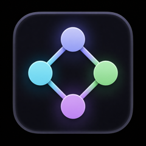
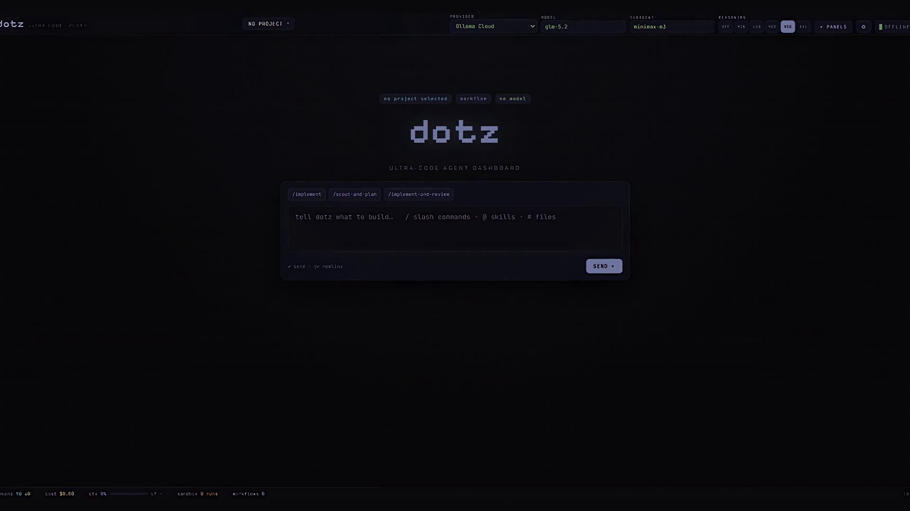
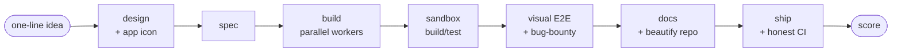
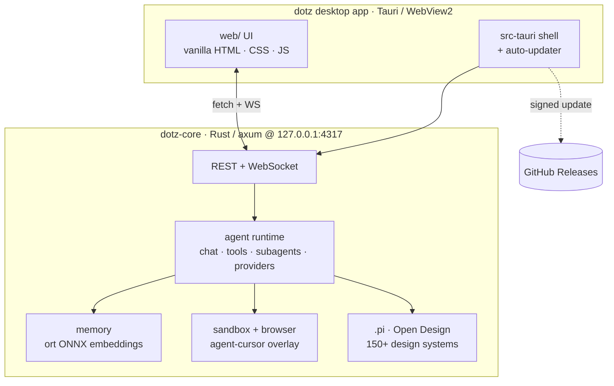

<div align="center">



# dotz

**The ultra-code agent dashboard — one prompt becomes a team of AI coding agents.**

[](https://github.com/cayleb-james2008/dotz/actions/workflows/ci.yml)
[](https://github.com/cayleb-james2008/dotz/releases/latest)
[](https://github.com/cayleb-james2008/dotz/releases/latest)
[](https://github.com/cayleb-james2008/dotz/releases/latest)
[](https://tauri.app)

</div>

dotz is a **native-Rust, Claude-Desktop-style coding-agent dashboard**. Give it one task and it
decomposes the work, disperses it to a team of subagents, runs them in parallel on a **live workflow
graph**, and adversarially verifies the result — with live controls for **model, reasoning effort,
tools, skills, and subagent orchestration**, all in a single self-updating desktop app.

Under the hood: `dotz-core` is an [axum](https://github.com/tokio-rs/axum) server with dotz's own
agent runtime (no third-party agent SDK, no subprocess), and a [Tauri](https://tauri.app) (WebView2)
shell wraps it into a signed, self-updating app. It is **multi-provider** (not just OpenRouter), keeps
**persistent projects** + an on-device **memory store** (`ort` ONNX embeddings) injected into the
agent's prompt, ships a **sandbox** with a live web preview the agent drives an on-screen cursor over,
and a native **Open Design** workspace (150+ design systems, live preview, HTML/PDF export).

<div align="center">

</div>

## Highlights

- **Live workflow graph** — every subagent materializes as a node, every tool it reaches for
  streams onto that node as a live chip; click any node/chip to open the exact panel it drives.
- **Multi-agent by default** — non-trivial tasks fan out to `scout` / `planner` / `worker` /
  `reviewer` subagents in parallel, then the result is adversarially verified before it lands.
- **Sessions over WebSocket** — the UI is a plain web app (`fetch` + WS streaming), identical in a
  browser against the headless `serve` bin and inside the Tauri window.
- **Sandbox with live web previews** — `terminal` runs stream output into chat; `web` runs render
  an inline preview iframe the agent drives with an on-screen cursor you both can see.
- **On-device memory** — automatic capture/recall/consolidation via `rusqlite` + local ONNX
  embeddings (all-MiniLM-L6-v2, in-process — no embeddings API), mirrored to a committable `MEMORY.md`.
- **Model-agnostic providers** — multi-provider auth with per-provider UI modes (free-form model-id
  input or fixed list) and a reasoning-effort slider constrained to what the model supports.
- **Origin-guarded local API** — the loopback axum server rejects disallowed `Origin`/`Host`
  requests with `403`, closing browser-CSRF and DNS-rebinding against the code-exec endpoints.
- **Skills + native Open Design** — a unified skill pool plus a design workspace with 150+ bundled
  design systems, live preview, and HTML/PDF export.
- **Signed self-updates** — `tauri-plugin-updater` verifies a minisign-signed `latest.json` from
  GitHub Releases and updates in place.

## How it works


Every non-trivial task fans out to `scout` / `planner` / `worker` / `reviewer` subagents that run in
parallel, then their output is adversarially verified before it lands. Pick a **profile** to change the
strategy (WORKFLOW · SOLO · PLAN · FRONTEND · BACKEND · DESIGN · NEW MODEL, NEW PROJECT).

### The live workflow graph — watch every agent and every tool

Dispatching work no longer happens off-screen. Every `subagent` call **materializes a live node** on
the workflow graph, and **every tool that agent reaches for** — memory, browser, sandbox, spec, vcs,
design — streams onto its node in real time as a **panel-colored sub-node chip** (running → done/error).
The graph is the single live visual of what the agents are doing; **click a node or a chip to open the
exact panel** that tool drives. Nothing pops open on its own — you watch it happen and drill in on
demand.

### NEW MODEL, NEW PROJECT — one prompt ships a repo

The **NEW MODEL, NEW PROJECT** profile turns one line into a genuinely-useful app shipped to a fresh
public GitHub repo, driven by a **required capability spine** — each phase is its own agent, so each is
a node on the graph:



The **design** phase picks a bundled Open Design system and produces an app icon; **sandbox** and a
**visual E2E / bug-bounty** phase (the agent launches the built app in its own web-sandbox and clicks
through the real frontend) are the authoritative ship gate; the repo is beautified (README, badges,
screenshot, topics) before it ships. A phase runs unless it's genuinely impossible, in which case it's
logged as `skipped <phase>: <reason>` — never faked.

## Architecture



- **`src-tauri/`** — thin Rust shell: starts dotz-core on `127.0.0.1:4317`, opens the WebView2 window, wires `tauri-plugin-updater` (signed cross-device updates).
- **`dotz-core/`** — axum server + dotz's own agent runtime: `agent/` (chat loop, tools, subagents, providers), `memory.rs` + `embed.rs` (on-device `ort` embeddings, all-MiniLM-L6-v2), `sandbox`/`browser` (agent-cursor overlay), `profiles.rs`/`projects.rs`, `server/` (REST + WS + the `serve` headless bin).
- **`web/`** — the cyberbrutalist chat UI (vanilla HTML/CSS/JS), identical in a browser and in the app.
- **`.pi/`** — bundled agent resources: agents, workflow prompts, and vendored Open Design content (150+ design systems + design skills).

The UI is a plain web app (`fetch` + `WebSocket`), so it runs identically in a browser pointed at the
headless `serve` binary and inside the Tauri window. See [docs/api-contract.md](docs/api-contract.md)
for the full UI↔backend contract, and [docs/design-prompt.md](docs/design-prompt.md) for the UI spec.

## Controls (the five knobs)

- **Profile** — the top-bar segmented picker switches dotz's operating mode. Each profile injects
  a doctrine (`appendSystemPrompt`) and a default tool set; switching it starts a fresh session.
    - **WORKFLOW** *(default)* — multi-agent dispersal: every non-trivial task is decomposed and
      dispersed to `scout` / `planner` / `reviewer` / `worker` subagents, then adversarially
      verified.
    - **SOLO** — single agent, direct execution, no subagents unless asked.
    - **PLAN** — read-only research + planning (`read, grep, find, ls, subagent`; no edits).
    - **FRONTEND** — workflow mode tuned for UI/design work (WCAG, real focus states, no AI-slop).
    - **BACKEND** — workflow mode tuned for APIs/data/infra (TDD, boring tech, honest errors).
    - **DESIGN** — graphic/visual design backed by native Open Design (gallery, preview, export — see below).
    - **NEW MODEL, NEW PROJECT** — autonomous "own the full arc": one idea → a shipped public GitHub
      repo, orchestrated as the required capability spine above (design → spec → build → sandbox → E2E
      → docs → ship → score), each phase a node on the live graph.
- **Model** — dotz is **multi-provider**, not just OpenRouter. Each provider declares its own UI
  mode via `ProviderMeta.freeForm`: OpenRouter is a **free-form model-id input** (not a giant
  dropdown), defaulting to `nex-agi/nex-n2-pro:free`; other providers may expose a fixed model list.
  The available-models list powers autocomplete suggestions.
- **Reasoning** — segmented slider `off → minimal → low → medium → high → xhigh`, constrained to
  what the active model supports.
- **Tools** — live toggle of pi's built-ins (`read, bash, edit, write, grep, find, ls`) plus the
  bundled `subagent` tool.
- **Skills / Subagents** — the bundled `.pi/` resources provide the `subagent` tool plus panel-backed
  tools (`design_*`, `sandbox_run`, `openspec_*`, `vcs_*`, `living_docs_*`, `memory_*`, `browser_*`,
  `rsi_*`), a roster of specialist agents (`scout`, `planner`, `worker`, `reviewer`, `ui-ux-pro`,
  `spec-owner`, `sandbox-runner`, `browser-operator`, `build-fixer`, `docs-maintainer`,
  `platform-operator`, `security-reviewer`, `self-improvement-reviewer`, `skill-agent-builder`,
  `project-auditor`), and workflow presets: `/implement`, `/scout-and-plan`, `/implement-and-review`,
  `/design`, `/goal`, `/improve`, `/e2e-test`, `/bug-bounty`, `/self-improve`, `/ultra-code-review`,
  `/pantheon`. Invoke one by sending it in the composer (e.g. `/implement add a dark-mode toggle`).

## Projects, Memory, and Sandbox

- **Projects** — persistent named workspaces. Each `Project` binds a name, a `cwd`, and default
  `profile` / `model` / `thinking` settings; sessions created with a `projectId` inherit those
  defaults. Projects survive server restarts, so you can keep one config per codebase and jump back
  into it without re-configuring every session.
- **Memory** — an **autonomous, on-device memory store** (`rusqlite` + local ONNX embeddings,
  all-MiniLM-L6-v2, injected in-process — no embeddings API). Durable facts (`project` or `global`
  scope) are **captured automatically** from each task, **recalled automatically** before the next one
  (semantic search of the folder + global memory, injected into the turn), and **consolidated
  automatically** — you never manage it. A git-committable `MEMORY.md` mirror is the source of truth;
  the vector index is a derived cache. Memory persists across restarts alongside projects.
- **Sandbox** — run code in two modes. **`terminal`** mode streams stdout/stderr back into the
  chat. **`web`** mode starts a long-lived process bound to a local HTTP port and the UI renders an
  inline web preview iframe at that port; the agent drives an **agent cursor** over the live
  preview (`move` / `click` / `type` at `(x, y)`) and both the agent and the user see the same
  pointer state via `sandbox_cursor` events. Run lifecycle: `pending → running → done|error|killed`.

## Design mode (Open Design, native)

dotz ships a native port of [Open Design](https://github.com/nexu-io/open-design) — its content,
in dotz's own shell. Open the **DESIGN panel** from the `+ PANELS` palette: a design workspace with
a searchable gallery of **150+ bundled design systems** (Stripe, Linear, Apple, Notion, Vercel,
Figma, …), a live same-origin preview iframe, and one-click **HTML / PDF export** of the rendered
artifact.

- **Design systems** live at `.pi/design-systems/<slug>/` (each a `DESIGN.md` + `tokens.css` +
  `components.html`), served read-only via `GET /api/design/systems`. Apache-2.0 — see the bundled
  `LICENSE` + `NOTICE`.
- **Design skills** (150+) are vendored into the unified skill pool tagged `source: design` at
  *lowest* priority (they never shadow your own same-named skills) and kept out of the always-on
  prompt index — load any by name with the `skill` tool.
- **DESIGN profile** makes design the operating mode for a session; **`/design <brief>`** kicks off
  a design workflow; and an **auto-route** opens the panel + injects the Open Design doctrine
  whenever a request looks graphic/design-related, so design work lands in the native workspace even
  from another profile.

The preview iframe is sandboxed (`allow-same-origin allow-modals allow-popups`, **no** `allow-scripts`)
since the bundled systems are static HTML/CSS — a hardened default that still supports print-to-PDF.

## Setup

```bash
npm install        # ships the agent-browser binary + the @huggingface/transformers model fetcher
npm run fetch-model    # downloads the all-MiniLM-L6-v2 ONNX model into assets/models/ (bundled by Tauri)
```

dotz resolves provider auth from `~/.pi/agent/auth.json` → env vars. Set keys for the providers you
use — **Ollama Cloud** is the primary (executive `glm-5.2`, subagent `minimax-m3`) and **OpenRouter**
is the free fallback (`nex-agi/nex-n2-pro:free`):

```bash
OLLAMA_API_KEY=...        # primary — Ollama Cloud
OPENROUTER_API_KEY=...    # fallback — OpenRouter :free models
```

See [.env.example](.env.example). Never commit real keys.

## Run

```bash
# Headless backend (browser dev loop) — open http://127.0.0.1:4317
cargo run -p dotz-core --bin serve

# Native desktop window (Tauri / WebView2)
cargo tauri dev
```

## Build the installer

```bash
cargo tauri build   # → src-tauri/target/release/bundle/nsis/  (signed NSIS installer + latest.json)
```

The signed build needs the updater signing key in the environment — see
[src-tauri/DEPLOY.md](src-tauri/DEPLOY.md) for the full build + release flow.

## Development & gates

CI ([`.github/workflows/ci.yml`](.github/workflows/ci.yml)) runs on every push and PR to `main`
(on `windows-latest`) and is the merge gate — run the same three commands locally before pushing:

```bash
cargo fmt --all -- --check
cargo clippy -p dotz-core --all-targets -- -D warnings
cargo test -p dotz-core
```

The embed tests need the bundled all-MiniLM-L6-v2 model files (`npm run fetch-model` first).
Repo guard tests under `dotz-core/tests/` enforce standing invariants — e.g. `windowless_guard.rs`
(child processes must never flash a console window) and `ort_pin_guard.rs` (the deliberate `ort`
pre-release pin, see Notes & caveats). Pushing a `v*` tag triggers
[`release.yml`](.github/workflows/release.yml), which builds the NSIS installer and cuts a draft
GitHub Release with the signed `latest.json` updater feed.

## Cross-device auto-update

The installed app self-updates via `tauri-plugin-updater`: it checks this repo's
[latest release](https://github.com/cayleb-james2008/dotz/releases/latest) for a minisign-signed
`latest.json`, verifies it against the bundled pubkey, and installs + relaunches in place. Source and
signed releases live in this one public repo. Full topology and the release commands are in
[src-tauri/DEPLOY.md](src-tauri/DEPLOY.md).

## Notes & caveats

- **Multi-provider auth**: dotz uses pi's normal auth resolution (`~/.pi/agent/auth.json` → env
  vars). Provide a working provider key for whichever provider you select — **Ollama Cloud**
  (`OLLAMA_API_KEY`, the primary: executive `glm-5.2`, subagent `minimax-m3`) or **OpenRouter**
  (`OPENROUTER_API_KEY`, the free fallback). **OpenRouter credits**: provider errors surface
  in-chat (e.g. `402 … can only afford N tokens`). Use `:free` models (the default
  `nex-agi/nex-n2-pro:free`) when the account balance is low.
- **Subagents** run in dotz's native runtime (each a separate LLM run); the bundled agents default
  to the free model so `/implement` is runnable out of the box. Edit `.pi/agents/*.md` to change models.
- **Fonts** load from Google Fonts (online). Bundle locally for fully-offline use.
- **`ort` is pinned to a pre-release on purpose** (`=2.0.0-rc.12` in `dotz-core/Cargo.toml`):
  no stable 2.x exists on crates.io yet (checked 2026-07-13) and the pin transitively fixes the
  ONNX Runtime (1.24.2, checksummed) that `download-binaries` bundles into the installer.
  Enforced by `dotz-core/tests/ort_pin_guard.rs`. **Watch:** when a stable `ort 2.0.0` ships,
  bump deliberately — update the pin, the guard test's `PINNED`, and re-verify the embedder
  (`cargo test -p dotz-core`, embed tests need the bundled all-MiniLM-L6-v2 model files).
- The UI was specced for and can be refined in [claude.ai/design](https://claude.ai/design).

## License

dotz is **source-available, not open source**. The official binary releases are **free to download
and use** (personal or commercial); the source is published so you can read it and so the app can
self-update. Copying, modifying, forking, redistributing, or reusing the source/binaries is not
permitted without written permission. Vendored third-party content under `.pi/` (the Open Design
systems/skills) keeps its own Apache-2.0 license. See [LICENSE](LICENSE) for the full terms.
