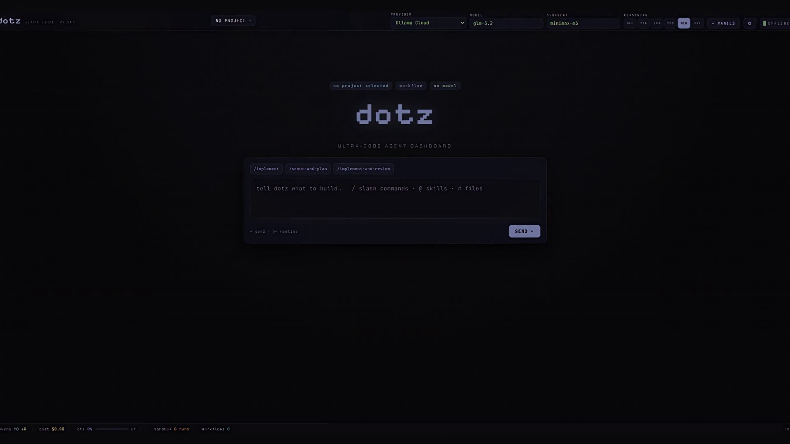
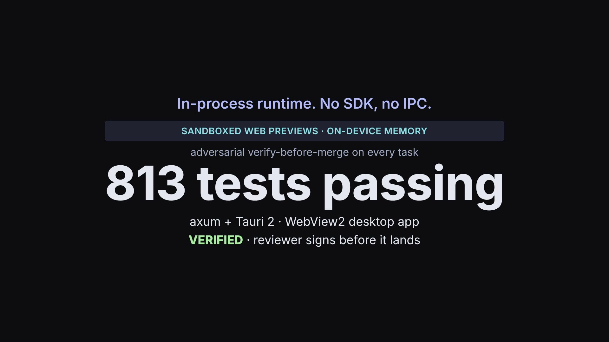
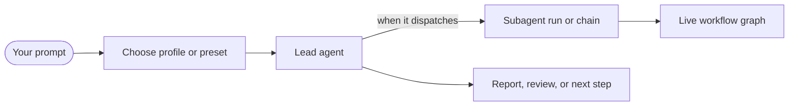
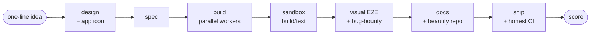
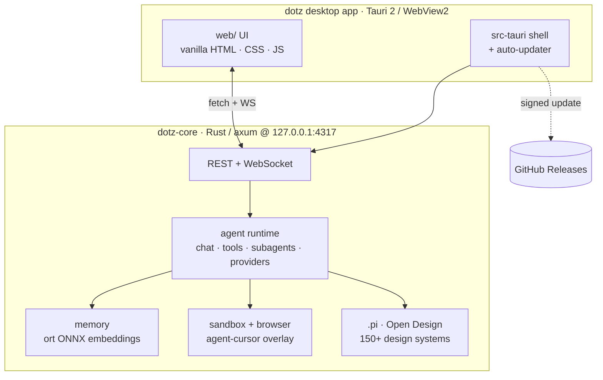

<div align="center">


# dotz

**An in-process coding dashboard for directing work to a team of AI coding agents.**

[](LICENSE)
[](#what-works-today)
[](https://tauri.app)
[](dotz-core/Cargo.toml)

> Release availability is not runtime acceptance. On 2026-10-10, unauthenticated GET checks
> returned HTTP 200 for the latest release and updater manifest (version `0.2.8`,
> `windows-x86_64` only). See [What works today](#what-works-today) for the evidence limits.
> The tag-triggered [release workflow](.github/workflows/release.yml) is configured to build
> Windows NSIS and updater artifacts and create a draft release; it is not an acceptance gate.

</div>

I'm working on **dotz**, a Rust/Tauri coding dashboard that brings agent sessions, a workflow graph,
persistent projects, and local memory into one interface. My current focus is making setup and
process cleanup reproducible, with tests and clear notes about what has actually been checked.

The backend is an [axum](https://github.com/tokio-rs/axum) server with an in-process Rust agent runtime;
the UI is plain HTML, CSS, and JavaScript, wrapped by a [Tauri](https://tauri.app) 2 desktop shell.
The lead can delegate to subagents, and the graph displays dispatched work and tool calls. Profiles
and slash-command prompts request different strategies: sequential chains, review, parallel
dispatch, or direct work by one agent. None of those prompts guarantees a finished or approved repo.

The source includes multi-provider adapters, persistent projects, SQLite memory with local ONNX
embeddings, a managed tool runner, and a design workspace built around vendored
[Open Design](https://github.com/nexu-io/open-design) resources. Local embeddings do **not** mean
conversation text stays local: chat and best-effort memory extraction use configured endpoints.
Windows packaging and updater wiring are present; verified release/runtime behavior is listed
separately below.

<div align="center">

</div>

## Table of Contents

- [Highlights](#highlights)
- [How It Works](#how-it-works)
- [Agent-team workflow](docs/agent-team-workflow.md)
- [Architecture](#architecture)
- [Safety Patterns](#safety-patterns)
- [Tech Stack](#tech-stack)
- [Controls](#controls-the-five-knobs)
- [Projects, Memory, and Sandbox](#projects-memory-and-sandbox)
- [Design Mode](#design-mode-open-design-native)
- [Setup](#setup)
- [Build and Test](#build-and-test)
- [Development and Gates](#development-and-gates)
- [Cross-device Auto-update](#cross-device-auto-update)
- [What works today](#what-works-today)
- [Contributing](#contributing)
- [License](#license)

## Launch video

[](brag-output/brag.mp4)

*20-second launch video rendered with `/brag` + Hyperframes — click the still to watch.*

## Highlights

- **Live workflow graph** — every subagent materializes as a node, every tool it reaches for
  streams onto that node as a live chip; click any node/chip to open the exact panel it drives.
- **Agent-team workflows** — the lead can delegate to specialist subagents. The `/implement` and
  `/implement-and-review` presets use different sequences; see the [agent-team walkthrough](docs/agent-team-workflow.md).
- **In-process runtime** — no IPC serialization, no subprocess per agent, no third-party agent SDK.
  The entire agent runtime (chat loop, tools, subagents, providers) lives inside `dotz-core`.
- **Sessions over WebSocket** — the shared UI uses `fetch` + WS streaming against headless `serve`
  or the Tauri shell. Desktop bridges and platform-specific behavior need their own checks.
- **Managed tool sandbox** — `terminal` mode streams stdout/stderr back into chat; `web` mode
  renders an inline preview iframe the agent drives with an on-screen cursor you both can see.
  Profiles gate which tools are available (the PLAN profile uses a fixed tool allowlist),
  the in-app browser enforces an origin allowlist, and the loopback API rejects
  disallowed `Origin`/`Host` with `403`. The `bash` tool itself runs the given command
  in the session cwd with a wall-clock timeout — review commands in `terminal` mode.
- **Local memory storage and embeddings** — `rusqlite` + local ONNX all-MiniLM-L6-v2 embeddings,
  mirrored to a committable `MEMORY.md`. Recall and capture are best-effort; fact extraction uses
  a configured chat endpoint, and optional Cognee can receive queries and captured facts.
- **Model-agnostic providers** — multi-provider auth with per-provider UI modes (free-form model-id
  input or fixed list) and a reasoning-effort slider constrained to what the model supports.
- **Origin-guarded local API** — rejects disallowed `Origin`/`Host` with `403`. These checks do not
  authenticate hostile local processes; the optional session-token guard is a separate boundary.
- **Skills + native Open Design** — a unified skill pool plus a design workspace with 150+ bundled
  design systems, live preview, and HTML/PDF export.
- **Updater wiring** — `tauri-plugin-updater` uses the GitHub Releases manifest and bundled public
  key to verify downloaded update artifacts. This is separate from Authenticode signing and from
  an exercised install/relaunch journey.

## How It Works


```mermaid
flowchart LR
    U([Your prompt]) --> P[Choose profile or preset]
    P --> L[Lead agent]
    L -->|when it dispatches| A[Subagent run or chain]
    A --> G[Live workflow graph]
    L --> R[Report, review, or next step]
```

Delegation depends on the selected profile or prompt and the lead agent's decisions; an ordinary chat
message does not guarantee that subagents will run. The `/implement` preset uses a sequential
`scout → planner → worker` chain after its OpenSpec and branch setup. `/implement-and-review` uses a
`worker → reviewer → worker` chain. Neither preset runs those steps in parallel. The WORKFLOW profile
encourages delegation, while SOLO and PLAN offer direct-execution and read-only strategies. See the
[agent-team walkthrough](docs/agent-team-workflow.md) for the complete sequences and their limits.

### The Live Workflow Graph — Watch Every Agent and Every Tool

Dispatching work no longer happens off-screen. Every `subagent` call **materializes a live node** on
the workflow graph, and **every tool that agent reaches for** — memory, browser, sandbox, spec, vcs,
design — streams onto its node in real time as a **panel-colored sub-node chip** (running → done/error).
The graph is the single live visual of what the agents are doing; **click a node or a chip to open the
exact panel** that tool drives. Nothing pops open on its own — you watch it happen and drill in on
demand.

### NEW MODEL, NEW PROJECT — A Prompt for the Full Project Arc

This profile requests design, specification, implementation, checks, documentation, and
publication in one workflow. The diagram describes the requested phases, not an enforced execution
plan or proof that one prompt ships a working app:


```mermaid
flowchart LR
    I([one-line idea]) --> D[design<br/>+ app icon]
    D --> S[spec]
    S --> B[build<br/>parallel workers]
    B --> SV[sandbox<br/>build/test]
    SV --> E[visual E2E<br/>+ bug-bounty]
    E --> DOC[docs<br/>+ beautify repo]
    DOC --> SH[ship<br/>+ honest CI]
    SH --> SC([score])
```

The prompt asks for a bundled design system and app icon, sandbox checks, visual E2E/bug review,
and readable repository docs. Actual delegation depends on the model, tools, and request. Inspect
the resulting diffs, checks, and runtime receipts before publishing; a graph node or model verdict
is not a ship gate. Keep failed and skipped phases visible with their reasons.

## Architecture


```mermaid
flowchart TD
    subgraph App["dotz desktop app · Tauri 2 / WebView2"]
        UI["web/ UI<br/>vanilla HTML · CSS · JS"]
        Shell["src-tauri shell<br/>+ auto-updater"]
    end
    subgraph Core["dotz-core · Rust / axum @ 127.0.0.1:4317"]
        API["REST + WebSocket"]
        Agent["agent runtime<br/>chat · tools · subagents · providers"]
        Mem["memory<br/>ort ONNX embeddings"]
        Sand["sandbox + browser<br/>agent-cursor overlay"]
        Dsgn[".pi · Open Design<br/>150+ design systems"]
    end
    GH[(GitHub Releases)]
    UI <-->|fetch + WS| API
    Shell --> API
    API --> Agent
    Agent --> Mem
    Agent --> Sand
    Agent --> Dsgn
    Shell -.->|signed update| GH
```

### Component Overview

| Component | Path | Role |
|-----------|------|------|
| **dotz-core** | `dotz-core/` | The pure library + headless `serve`/`selfeval` bins. Owns the whole agent runtime: provider adapters, sessions, the workflow DAG, sandbox, isolated browser, on-device memory, skills, projects, specs. Exposes it over a lean axum + tower-http REST + WebSocket surface. |
| **dotz-tauri** | `src-tauri/` | A thin Tauri 2 shell (`src/main.rs` + `build.rs`) that boots dotz-core on `127.0.0.1:4317`, opens the UI in the platform webview (WebView2 on Windows), and wires updater check/install commands. |
| **web/** | `web/` | The dashboard UI — vanilla HTML/CSS/JS, no frontend build step or framework. Shared by headless `serve` and the desktop shell; native-only bridges still need separate checks. |
| **.pi/** | `.pi/` | Bundled agent resources: agent profiles, workflow prompts, design systems, design skills. |

### Agent Roles

| Role | Responsibility |
|------|---------------|
| **Lead agent** | Receives the user prompt, decomposes the task, disperses subagents, conducts verification, delivers the result. |
| **Scout** | Research and context-gathering: memory recall, codebase exploration, reading existing patterns. |
| **Planner** | Architecture and task breakdown: maps the work into build units, sequences dependencies. |
| **Worker** | Implementation: writes code, runs tests, fixes bugs; runs sequentially or in parallel according to the dispatch. |
| **Reviewer** | When requested, audits the implementation against the spec, tests, and quality bar; its output requires inspection. |

### Workflow DAG

The workflow graph is the **single source of truth** — execution and observability read the same
`WorkflowStep` nodes. Steps transition `pending → ready → running → done|error|skipped`; children
auto-promote to `ready` when all parents are `done`. The UI renders the live DAG as an interactive
SVG node/edge graph.

Lead-session subagent calls use this executor. A custom agent that explicitly enables nested
`subagent` calls uses the direct dispatcher; those nested runs do not create their own workflow
nodes. See the [workflow guide](docs/agent-team-workflow.md) for dispatch limits and timeout layers.

- `workflows.rs` — the `WorkflowRun` DAG domain (`WorkflowStep`, `ToolCallRef` with inspectable
  `args`+`result`).
- `workflow_executor.rs` — drives steps to completion.
- `agent/subagent.rs` — runs each subagent as an isolated LLM run, emits `step_tool` +
  `step_thinking` events onto the workflow channel. The sole emitter of those events.

## Safety Patterns

dotz exposes runtime controls and review tools. Their use depends on the selected profile, enabled
tools, and workflow; inspect the resulting actions and checks.

### 1. Managed Tool Runs

The tool sandbox is a managed run store (run lifecycle `pending → running → done|error|killed`,
`dotz-core/src/sandbox.rs`). Allowlists apply at the boundaries: profiles gate which tools an
agent may call (see `PLAN_TOOLS` in `dotz-core/src/agent/tools.rs`), the in-app browser enforces
an origin allowlist (`dotz-core/src/browser.rs`), and the loopback API rejects disallowed
`Origin`/`Host` with `403` (`dotz-core/src/server/guard.rs`). The `bash` tool itself runs the
given command in the session cwd with a wall-clock timeout — no command allowlist.

**Unmerged candidate work:** Linux sandbox runs, `bash`, and RSI verification gates each use a
per-command PID namespace and fail closed when they cannot create one. Background processes and
inherited output-pipe holders are removed when that command's root exits; use a managed `web`
sandbox run for a persistent preview instead of shell backgrounding. This is process lifecycle
containment, not filesystem or network
isolation, and is not a current-main or release acceptance claim. Windows keeps `taskkill /T`;
macOS uses process-group signaling. Neither establishes the Linux namespace guarantee. The browser
has a persistent Chrome daemon whose lifetime spans one-shot commands. Persistent browser ownership
and pre-spawn cancellation repairs are under implementation/review; this documentation does not
claim those gaps are fixed. The sandbox runs in two modes:

- **`terminal`** mode — streams stdout/stderr back into the chat panel.
- **`web`** mode — starts a long-lived process bound to a local HTTP port; the UI renders an inline
  preview iframe, and the agent drives an **agent cursor** over the live preview (`move` / `click` /
  `type` at `(x, y)`). Both the agent and the user see the same pointer state via `sandbox_cursor`
  events.

Run lifecycle: `pending → running → done|error|killed`. The sandbox owns process lifecycle for both
modes — no other module spawns sandbox processes directly.

### 2. Explicit Review Workflows

The `/implement-and-review` prompt requests a sequential `worker → reviewer → worker` chain;
`/implement` does not include a reviewer. A reviewer is another model run, and its response is input
to the next step. The graph records execution status; it does not automatically certify a reviewer's
verdict or prevent commits and merges when review was omitted. Inspect the diff and project checks
before accepting the result. See the [workflow guide](docs/agent-team-workflow.md).

### 3. Interactive Human Approval

When the lead agent calls `human_gate`, dotz sends an approval card over the session WebSocket and
waits up to five minutes for an operator response. Approval returns a tool result; rejection or a
timeout returns an error. The tool requires an interactive session and is unavailable to subagents
(`dotz-core/src/agent/extra_tools.rs`). It is not automatically inserted into every workflow or a
runtime policy that blocks every sensitive action; the lead must request it before proceeding.

## Tech Stack

### Current Stack

| Layer | Technology | Notes |
|-------|-----------|-------|
| **Language** | Rust (edition 2024) | Agent runtime in Rust; Node.js is needed for dependency/model setup |
| **Backend** | axum + tower-http + tokio | REST + WebSocket on `127.0.0.1:4317` |
| **Desktop shell** | Tauri 2 (WebView2) | Thin shell — boots core, opens window, wires updater |
| **Frontend** | Vanilla HTML/CSS/JS | No build step, no framework, no bundle |
| **Embeddings** | `ort` (ONNX Runtime) + `tokenizers` | all-MiniLM-L6-v2, in-process, no embeddings API |
| **Vector store** | `rusqlite` (bundled SQLite) | Derived cache; `MEMORY.md` is the source of truth |
| **HTTP client** | `reqwest` | Provider API calls, SSE streaming |
| **Serialization** | `serde` + `serde_json` + `serde_yaml_ng` | Config, provider payloads, skill frontmatter |
| **Packaging** | `cargo tauri build` → platform bundles | Windows NSIS + updater artifacts configured; signing and native acceptance need receipts |

### Implemented Dependencies and Possible Next Steps

`ort` is exact-pinned to `=2.0.0-rc.12`, guarded by `ort_pin_guard.rs`. The current embedder creates
an ONNX session without selecting a GPU execution provider; I do not claim DirectML acceleration.
`tracing` and `tracing-subscriber` are already declared dependencies, not future additions; that
does not mean every log site is instrumented. `winres` is already a desktop build dependency,
invoked on Windows in `src-tauri/build.rs` (resource compilation failure is a warning).

LanceDB and Slint remain possible future changes, not implemented features or committed migrations.
The current memory index is SQLite and the current UI is HTML/CSS/JS. I'd only replace those pieces
after measuring a problem they cannot reasonably solve.

## Controls (the five knobs)

- **Profile** — the top-bar segmented picker switches dotz's operating mode. Each profile injects
  a doctrine (`appendSystemPrompt`) and a default tool set; switching it starts a fresh session.
    - **WORKFLOW** *(default)* — encourages the lead agent to delegate non-trivial work; actual
      dispatch and review steps depend on the request and workflow prompt.
    - **SOLO** — single agent, direct execution, no subagents unless asked.
    - **PLAN** — read-only research + planning (`read, grep, find, ls, subagent`; no edits).
    - **FRONTEND** — workflow mode tuned for UI/design work (WCAG, real focus states, no AI-slop).
    - **BACKEND** — workflow mode tuned for APIs/data/infra (TDD, boring tech, honest errors).
    - **DESIGN** — graphic/visual design backed by native Open Design (gallery, preview, export).
    - **NEW MODEL, NEW PROJECT** — requests the full project arc described above; execution,
      publication, and acceptance still depend on tools, results, and operator inspection.
- **Model** — dotz is **multi-provider**, not just OpenRouter. Each provider declares its own UI
  mode via `ProviderMeta.freeForm`: OpenRouter is a **free-form model-id input** (not a giant
  dropdown), defaulting to `nex-agi/nex-n2-pro:free`; other providers may expose a fixed model list.
- **Reasoning** — segmented slider `off → minimal → low → medium → high → xhigh`, constrained to
  what the active model supports.
- **Tools** — live toggle of the built-ins (`read, bash, edit, write, grep, find, ls`) plus the
  bundled `subagent` tool.
- **Skills / Subagents** — the bundled `.pi/` resources provide the `subagent` tool plus panel-backed
  tools (`design_*`, `sandbox_run`, `openspec_*`, `vcs_*`, `living_docs_*`, `memory_*`, `browser_*`,
  `rsi_*`), a roster of specialist agents, and workflow presets: `/implement`, `/scout-and-plan`,
  `/implement-and-review`, `/design`, `/goal`, `/improve`, `/e2e-test`, `/bug-bounty`, `/self-improve`,
  `/ultra-code-review`, `/pantheon`. Invoke one by sending it in the composer.

## Projects, Memory, and Sandbox

- **Projects** — persistent named workspaces. Each `Project` binds a name, a `cwd`, and default
  `profile` / `model` / `thinking` settings; sessions created with a `projectId` inherit those
  defaults. Projects survive server restarts.
- **Memory** — storage and sentence embeddings run locally with `rusqlite` and ONNX Runtime
  (all-MiniLM-L6-v2, no embeddings API). The database is
  `<DOTZ_CONFIG_DIR>/ai-agents/memory.db`, defaulting to `~/.dotz/ai-agents/memory.db`.
  `MEMORY.md` mirrors live at `~/.dotz/ai-agents/MEMORY.md` and `<cwd>/.ai-agents/MEMORY.md`
  (the global path follows `DOTZ_CONFIG_DIR`); the vector index is a derived cache.
  The Rust session loop attempts query-relevant recall before a turn and fact capture after an
  exchange. Capture sends the exchange to a configured OpenAI-compatible chat endpoint, defaulting
  to Ollama Cloud; missing credentials or extraction errors can yield no facts. Near-duplicate
  pruning runs locally. If `DOTZ_COGNEE_URL` is configured, recall queries and captured facts can
  also go to that service. Inspect/edit stored memories through the panel or API: automatic attempts
  do not guarantee useful capture, and local embeddings do not make the app offline or private
  from its configured services. See [the API contract](docs/api-contract.md#memory-local-storage-and-embeddings-best-effort-capture).
- **Sandbox** — run code in two modes. **`terminal`** mode streams stdout/stderr back into the
  chat. **`web`** mode starts a long-lived process bound to a local HTTP port and the UI renders an
  inline web preview iframe at that port; the agent drives an **agent cursor** over the live
  preview. Run lifecycle: `pending → running → done|error|killed`.

## Design Mode (Open Design, native)

The design workspace adapts vendored content from the
[Open Design authors](https://github.com/nexu-io/open-design) to dotz's own shell; those resources
are not my original design systems. Open the **DESIGN panel** from the `+ PANELS` palette for
a searchable gallery of bundled design systems (Stripe, Linear, Apple, Notion, Vercel,
Figma, …), a live same-origin preview iframe, and one-click **HTML / PDF export** of the rendered
artifact.

- **Design systems** live at `.pi/design-systems/<slug>/` (each a `DESIGN.md` + `tokens.css` +
  `components.html`), served read-only via `GET /api/design/systems`. Apache-2.0 — see the bundled
  [LICENSE](.pi/design-systems/LICENSE) + [NOTICE](.pi/design-systems/NOTICE).
- **Design skills** (150+) are vendored into the unified skill pool tagged `source: design` at
  *lowest* priority (they never shadow your own same-named skills) and kept out of the always-on
  prompt index — load any by name with the `skill` tool.
- **DESIGN profile** makes design the operating mode for a session; **`/design <brief>`** kicks off
  a design workflow; and an **auto-route** opens the panel + injects the Open Design doctrine
  whenever a request looks graphic/design-related.

The preview iframe is sandboxed (`allow-same-origin allow-modals allow-popups`, **no** `allow-scripts`)
since the bundled systems are static HTML/CSS — a hardened default that still supports print-to-PDF.

The 2026-10-10 exact-main tree audit at `430d6a2d9abfcbfe3463d4453573ac66a62b892d` counted
150 `DESIGN.md` and 156 design-skill `SKILL.md` resources. These are resource counts, not tested
integrations. Keep the [skill notice](.pi/design-skills/NOTICE), adjacent license, and individual
upstream licenses/credits when redistributing them.

## Setup

### Prerequisites

- [Rust](https://rustup.rs/) (stable, edition 2024)
- [Node.js](https://nodejs.org/) and npm (for the agent-browser binary + ONNX model fetch)
- [Tauri 2 prerequisites](https://v2.tauri.app/start/prerequisites/) (WebView2 on Windows)
- Linux candidate sandbox runs, shell tools, and RSI gates require `unshare` with working user/PID namespaces; unavailable
  containment is an error, not a reason to run the workload uncontained
- Python 3 and Chromium/Chrome (for `npm run test:ui`)

### Install dependencies

Run setup/build commands from the repository root. For a new development checkout:

```bash
git clone --branch main https://github.com/cayleb-james2008/dotz.git
cd dotz
```

Identify an unmerged candidate by its exact revision separately; these instructions are not a
fresh-download acceptance receipt for that candidate.

```bash
npm run install:deps     # installs dependencies and runs only approved lifecycle hooks
npm run fetch-model      # downloads the all-MiniLM-L6-v2 ONNX model into assets/models/ (bundled by Tauri)
```

`package.json` carries version-pinned `allowScripts` approvals for the four dependencies that need
install hooks (`agent-browser`, `onnxruntime-node`, `protobufjs`, and `sharp`). The wrapper enforces
that exact list instead of relying on npm's version-dependent policy: it installs with
`--ignore-scripts`, then runs `npm rebuild` only for approved packages that are present at the pinned
version. A local fixture on npm 11.19.0 still ran an unapproved lifecycle hook after warning, so use
`npm run install:deps` rather than raw `npm install` when relying on this gate.

`npm run install:deps` sets `SHARP_IGNORE_GLOBAL_LIBVIPS=1` for both child phases. This prevents an
unrelated system libvips installation from forcing Sharp's source-build path (which requires
`node-addon-api` and `node-gyp`). Approved postinstall scripts remain enabled; network access is
required for the `onnxruntime-node` runtime download.

### Provider configuration

dotz resolves provider auth from non-empty environment variables first, then `~/.pi/agent/auth.json`.
Set keys for the providers you use — **Ollama Cloud** is the primary (executive `glm-5.2`, subagent `minimax-m3`) and **OpenRouter**
is the free fallback (`nex-agi/nex-n2-pro:free`):

```bash
export OLLAMA_API_KEY="..."        # primary — Ollama Cloud
export OPENROUTER_API_KEY="..."    # fallback — OpenRouter :free models
```

Use only the providers you need. [.env.example](.env.example) is a reference, not proof of a `.env`
loader: export variables in the launching shell or save keys in-app. See
[provider setup](docs/provider-setup.md) for PowerShell, precedence, and request-header differences.
Never commit real keys.

## Build and Test

### Run in development

```bash
# Headless backend (browser dev loop) — open http://127.0.0.1:4317
cargo run -p dotz-core --bin serve

# Native desktop window (Tauri; WebView2 on Windows)
cargo tauri dev
```

### Build the installer

```bash
cargo tauri build   # Windows NSIS output: target/release/bundle/nsis/
```

Updater-signed artifacts need the signing key in the environment; this is not Authenticode — see
[src-tauri/DEPLOY.md](src-tauri/DEPLOY.md) for the full build + release flow.

### Tests

dotz ships an integration test suite under `dotz-core/tests/`:

| Test file | What it guards |
|-----------|---------------|
| `e2e.rs` | Backend + static-frontend e2e: spawns the real `serve` binary, exercises REST, static UI bundle, and WebSocket handshake over real HTTP. `e2e_offline` always runs (no tokens spent); `e2e_live_prompt` only with `DOTZ_E2E_LIVE=1`. |
| `windowless_guard.rs` | House-convention guard: every `Command::new` spawn site in shipped code must be windowless on Windows (no console window flash). |
| `ort_pin_guard.rs` | The `ort` dependency must stay exact-pinned until a stable 2.x exists — prevents silent ONNX Runtime swaps in shipped installers. |

The embed tests need the bundled all-MiniLM-L6-v2 model files (`npm run fetch-model` first).

## Development and Gates

CI ([`.github/workflows/ci.yml`](.github/workflows/ci.yml)) runs on pushes to `main` and on pull
requests, across Windows, Ubuntu, and macOS. Each OS checks formatting, Clippy, model setup, and
core tests; Windows also runs the cold-start benchmark. Run the Rust checks locally before pushing:

```bash
cargo fmt --all -- --check
cargo clippy -p dotz-core --all-targets -- -D warnings
cargo test -p dotz-core --locked -- --test-threads=2
```

> All three OS test steps are blocking. The suite streams test output for diagnosis; a runner
> communication failure remains a failed gate until a fresh exact-head run completes.

Pushing a `v*` tag triggers [`release.yml`](.github/workflows/release.yml), configured to build
Windows NSIS/updater artifacts and create a draft GitHub Release. Successful build, publication,
signature verification, and runtime acceptance are separate checks.

## Cross-device Auto-update

The shell wires check and apply commands through `tauri-plugin-updater` in `src-tauri/src/main.rs`;
`src-tauri/tauri.conf.json` supplies the manifest endpoint and public key. The JSON manifest carries
platform artifact URLs and signatures; the updater verifies downloaded artifacts before installation.
The apply path calls `download_and_install` and then requests a restart. That source wiring is not
evidence that the native UI bridge, update installation, or relaunch has succeeded.

On 2026-10-10 at 18:07 UTC, both public release URLs returned HTTP 200; the manifest reported
`0.2.8` and `windows-x86_64`. The earlier 2026-09-18 HTTP 404 observation is historical, not the
current feed state. Neither HTTP availability nor a signature field proves signature validity,
Authenticode, or that a release was built from this unmerged candidate. See
[src-tauri/DEPLOY.md](src-tauri/DEPLOY.md) for build and release boundaries.

## What works today

I'm keeping source inspection, historical local receipts, hosted checks, and release acceptance
separate. This documentation pass reads the isolated integration snapshot
`c6b465616ec3e9b9ad679542330c5a8be249ba31` on 2026-10-10; it does not rerun or accept the runtime.
That snapshot locally reconciles main and draft candidates. Local integration is not a remote merge.

**Source inspection:** the Rust agent runtime, local embedder, project/memory persistence paths,
provider adapters, API guards, and updater commands are present in their respective modules.
`package.json` exposes `install:deps`; the wrapper installs with scripts disabled and rebuilds only
present, exact-version approved packages. Those facts explain the implementation, not its end-to-end
success. The shared web UI does not prove that native-only controls work on every OS.

**Dated evidence and retained limits:**

| Evidence | Scope / identity | Result and limit |
|----------|------------------|------------------|
| Independent local Rust receipt, 2026-10-08 | Linux, `d22a0567e7976427071ce5783d8f7fcc224dc1d1`; `cargo test -p dotz-core --locked -- --test-threads=1` | 824 passed / 0 failed, cached model assets; formatting and Clippy also passed. Historical local result, not this snapshot or exact-head hosted acceptance. Credential-gated tests can return without inference. |
| Installer-policy fixture described in the integration baseline | npm 11.19.0 fixture; not a fresh online setup receipt | Wrapper suppressed an unapproved hook and passed `SHARP_IGNORE_GLOBAL_LIBVIPS=1` to approved `sharp@0.34.5`. A fixture does not verify external runtime downloads or the complete quickstart. |
| Historical native package receipts | Extracted local Linux DEB journeys; the later digest-linked package is candidate `1bdb5df1eeb7988bb44524ce6e2cecef374695d1` | Onboarding, project/memory persistence and 384-dimensional local embeddings were recorded. An earlier first-run attempt failed; semantic-search diagnostic returned HTTP 401 and remains unverified. Distinct package receipts must not be combined into one build identity. No system-wide installation, independent rebuild, or current public-release acceptance is inferred. |
| Public release GET checks, 2026-10-10 18:07 UTC | [Latest release](https://github.com/cayleb-james2008/dotz/releases/latest), [updater manifest](https://github.com/cayleb-james2008/dotz/releases/latest/download/latest.json); unauthenticated | Both HTTP 200; latest redirected to `v0.2.8`, manifest version `0.2.8`, platform key `windows-x86_64`. No installer execution or new signature verification. |
| Candidate audit, 2026-10-10 | [PR218](https://github.com/cayleb-james2008/dotz/pull/218) at `016a4a3c49ba58097ca0f1a809520b623fa72b7e`; [PR219](https://github.com/cayleb-james2008/dotz/pull/219) at `45366fa2701d06d467f9c5fab814a95d69d8d934` | Both open draft/unmerged at audit. PR218 pull-request run `37781781173` failed on Ubuntu; Windows/macOS and dependency-policy jobs passed. No PR219 exact-head success established. These are dated observations, not final integration gates. |

**Not accepted by this documentation pass:**

- Final integrated-head CI and independent review, deliberate merge/default-branch readback, and
  fresh public-download setup/native primary journeys remain separate gates. Distinguish `push`
  from `pull_request` evidence and record the exact SHA for each result.
- Browser persistent-daemon teardown and pre-spawn cancellation repairs are active candidate work;
  no new cleanup acceptance is claimed here. Windows/macOS teardown has not been exercised by this
  lane and does not inherit the Linux namespace boundary.
- Windows native installer launch, Authenticode, release-to-candidate build identity, and actual
  update/install/relaunch need their own receipts. Tauri can build Linux/macOS bundles with their
  prerequisites; an NSIS build specifically needs a Windows build environment.
- Live provider inference is not established by an adapter, a readiness banner, or a gated test
  name. DirectML is not configured/verified by the inspected embedder.
- Benchmarks and telemetry examples are not current performance or adoption measurements. The
  weekly-active target in [telemetry docs](docs/telemetry.md) is a goal, not a measured user count.

## Contributing

Contributions are welcome! dotz is MIT-licensed and open to the community.

1. **Fork** the repository and create your branch from `main`.
2. **Run the gates** before pushing:
   ```bash
   cargo fmt --all -- --check
   cargo clippy -p dotz-core --all-targets -- -D warnings
   cargo test -p dotz-core --locked -- --test-threads=2
   ```
3. **Write tests** for any new behavior — the test suite under `dotz-core/tests/` is the gate.
4. **Open a PR** with a clear description of what changed and why. Reference any related issues.
5. **Keep diffs minimal** — follow the ponytail principle: shortest working diff, deletion over
   addition, one line over fifty.

See [CONTRIBUTING.md](CONTRIBUTING.md) for the full guide.

## Notes and Caveats

- **Multi-provider auth**: dotz resolves provider keys from env vars → `~/.pi/agent/auth.json`.
  Provide a working provider key for whichever provider you select.
- **Subagents** run in dotz's native runtime as separate model runs. Bundled model defaults still
  require a working endpoint, credentials, and model availability; a `:free` label is not an
  out-of-the-box execution guarantee. Edit `.pi/agents/*.md` to change models.
- **Fonts** load from Google Fonts (online). Bundle locally for fully-offline use.
- **`ort` is pinned to a pre-release on purpose** (`=2.0.0-rc.12` in `dotz-core/Cargo.toml`):
  the pin fixes the `ort-sys` download table for ONNX Runtime 1.24.2 with per-target checksums.
  `dotz-core/tests/ort_pin_guard.rs` enforces the exact dependency pin. Re-evaluate upstream
  versions deliberately; a dependency pin is not an independent reproducible-build attestation.

## License

dotz is licensed under the **MIT License** — see [LICENSE](LICENSE). Vendored third-party content
under `.pi/` (the Open Design systems/skills) keeps its own Apache-2.0 license.

## Modernization (September 2026)

The workspace declares Rust edition 2024. The dated test results above remain historical; inspect
the current commit's CI jobs and step results for current validation. A successful core-test job
does not validate the desktop installer, live-provider behavior, or sandbox isolation.
